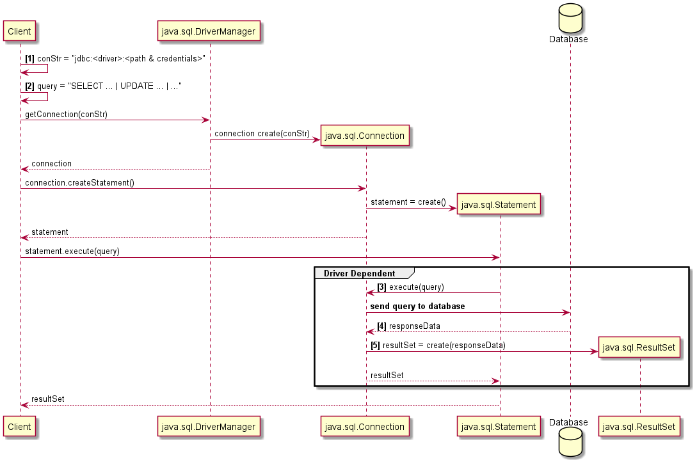

# [Reutilização de Software 2020/2021](https://moodle.ips.pt/2021/course/view.php?id=1864), [ESTS](https://www.estsetubal.ips.pt/) [IPS](https://www.ips.pt/ips_si/web_page.inicial)

## Exemplo JDBC com SQLite

A Java Virtual Machine (JVM) disponibiliza uma API para diálogo com bases de dados (BD), conhecida como Java Dabase Connectivity (JDBC).

JDBC abstrai a invocação de métodos com uma BD específica, oferecendo uma API padronizada, delegando aspetos específicos de cada base para um *driver* a instalar no lado do utilizador.

### Diálogo

O diálogo com uma base segue o seguinte modelo.

- [1] A *connection string* efine o protocolo a utilizar para a ligação. A base pode ser acedida localmente, como no caso do SQLite, ou remotamente. Pode ser necessário autenticar a ligação.
- [2] A query a executar é uma expressão SQL válida qualquer.
- [3] A execução da query é específica da base utilizada. Cada *driver* implemente um protocolo específico, que pode envolver, nomeadamente, a invocação de bibliotecas locais, ou invocação remota de métodos.
- [4] Os dados recebidos da base de dados, como resultado da *query*, estão num formato específico da base, e têm que ser normalizados.
- [5] A normalização é feita recorrendo ao padrão básico *Record Set*, representado pela interface `java.sql.ResultSet`.

## Licença
Copyright 2021 André Sabino

[BSD-3-Clause](LICENSE.txt)